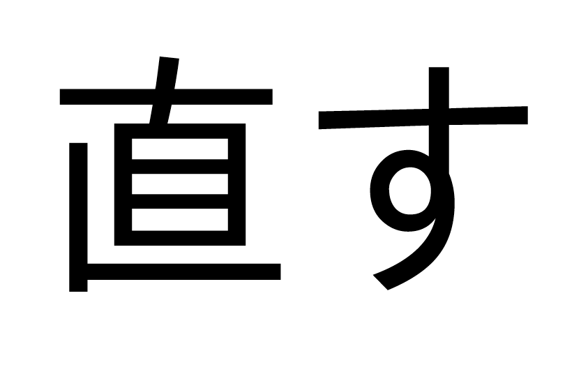

# Trước khi bắt đầu

## Những thứ bạn cần

Bạn cần biết hiragana và katakana, và một số lượng từ vựng tiếng Nhật cơ bản nhất định (Trong bộ thẻ Anki Kaishi1.5k chẳng hạn). Cách hiệu quả nhất để học kana (hiragana + katakana) là luyện tập. Bạn có thể dùng [trang luyện kana này](https://kuuuube.github.io/kana-quiz/kana/index.html).

Bạn cần biết tiếng Nhật dùng những hệ chữ nào, biết văn bản tiếng Nhật trông ra sao, và biết kanji là gì. Bạn cũng cần phải học từ vựng bên ngoài hướng dẫn này. Hướng dẫn này sẽ chỉ tập trung vào ngữ pháp.

**Kiểm tra thử:** Hán tự 直 trong từ 直す (naosu) trông như thế nào?

Nếu hiển thị như hình này:

thì bạn chưa cài phông chữ Tiếng Nhật. Chữ 直す phải trông như thế này:

thì mới đúng nhé. Còn cài như nào thì bạn tự tìm giúp mình nhé :>

## Cách sử dụng hướng dẫn này và học tiếng Nhật

Về cơ bản, đây là một hướng dẫn nhập môn. Hướng dẫn này có một quan điểm rất rõ ràng: cách duy nhất để tiếp thu các đặc điểm của ngôn ngữ và trở nên trôi chảy là tiếp xúc với chúng trong ngữ cảnh thực tế. Hướng dẫn này không cố gắng “nhồi” vào bạn cả đống ngữ pháp (mà phần lớn bạn không cần).

Khi đọc hướng dẫn này, đừng cố gắng ghi nhớ từng chi tiết.

Bạn không nên dành cả một tuần cho mỗi bài học. Thực tế, ngay cả một bài mới mỗi ngày cũng có thể là chậm, ngay cả khi bạn có ôn lại các bài cũ.

Mỗi bài học chính trong hướng dẫn này đều bao phủ ngữ pháp cơ bản. Bạn nên đọc toàn bộ càng nhanh càng tốt. Việc cho não tiếp xúc sớm quan trọng hơn là trì hoãn. Điều đó cho phép kiến thức có thời gian *“lớn lên”* một cách vô thức, và kể cả khi bạn cảm thấy mình chưa học được gì trong lần đầu đọc, nó vẫn sẽ giúp bạn nhớ tốt hơn ở những lần sau. Chỉ cần đừng mắc kẹt trong việc ôn đi ôn lại mãi.

Khi bạn đã đi được một đoạn đủ xa trong hướng dẫn này, bạn nên bắt đầu tiếp xúc với nội dung tiếng Nhật thật. Đặc biệt là đọc. Hướng dẫn này sẽ cho bạn biết khi nào là thời điểm phù hợp để bắt đầu, nhưng nếu bạn muốn thử sớm hơn thì cũng được thôi.

Cố gắng đọc thường xuyên, kể cả khi mỗi lần chỉ đọc được năm phút, sẽ cho bạn thấy rõ điểm yếu của mình ở đâu và giúp bạn cảm nhận được sự tiến bộ. Hướng dẫn này cho bạn tiếp xúc với ngữ pháp để có thể phân tích câu, nhưng bạn cần tiếp xúc với tiếng Nhật thật để biến sự tiếp xúc đó thành khả năng sử dụng.

Cách hiệu quả nhất để học từ vựng là bắt đầu [*nhặt từ* (mining) từ các nội dung bạn thích](https://lazyguidejp.github.io/jp-lazy-guide/), sau đó ghi nhớ chúng bằng flashcard. Cách này gọi là “mining”. Anki là phần mềm flashcard được gợi ý vì nó dùng phương pháp lặp lại ngắt quãng (Spaced Repetition), tức là những gì bạn biết tốt sẽ xuất hiện ít hơn. Lúc đầu, bạn cũng có thể dùng danh sách tần suất hoặc bộ thẻ chia sẻ sẵn của người khác nếu bạn chưa muốn tự mining hoặc thấy việc tiếp xúc với nội dung tiếng Nhật còn quá khó. Mình gợi ý bạn sử dụng bộ thẻ từ vựng [kaishi 1.5k](https://github.com/thu-tram/kaishi-vi/releases).

Nếu bạn muốn nói tiếng Nhật, bạn bắt buộc phải tiếp xúc với tiếng Nhật nói (về cơ bản là nghe tiếng Nhật), nếu không phát âm của bạn sẽ rất *thiếu tự nhiên*. Không quan trọng đó là anime, tin tức hay sống ở Nhật, miễn là bạn tiếp xúc với tiếng Nhật ở dạng nói (*nghe*), không phải chỉ dạng viết (*đọc*). Việc này có thể làm sau khi bạn đã học đọc, nhưng bạn nên cho mình tiếp xúc thụ động càng sớm càng tốt (qua visual novel, nhạc, anime, v.v.), nếu không não bạn sẽ mất rất lâu để nhận ra những khác biệt âm thanh tinh tế — giống như việc người Nhật phải được luyện thì mới phân biệt được L và R. Nếu bạn dành hầu hết thời gian để đọc và bỏ qua ngôn ngữ nói, bạn cũng có thể hình thành phát âm và trọng âm cao độ (pitch accent) không tự nhiên, và sau này sẽ khó sửa hơn.

## "Cứu với!"

Đừng căng thẳng. Hãy cố gắng tìm cách sử dụng hướng dẫn này theo hướng nhẹ nhàng, ít áp lực. Đừng tự dằn vặt vì thấy cái gì đó khó. Có những thứ đơn giản là cần thời gian.

Nếu bạn vẫn không biết phải làm gì, hoặc quay lại đây trong trạng thái bối rối:

- Bắt đầu học hiragana và katakana bên ngoài hướng dẫn này.
- Bắt đầu học từ vựng bên ngoài hướng dẫn này.
- Hiểu rằng không phải mọi kanji riêng lẻ đều là một từ tiếng Nhật hoàn chỉnh.
- Tự nhắc mình rằng tiếng Nhật không phải là bản sao từng từ một của Tiếng Việt.
- Nhiều khái niệm sẽ không thể hiểu theo kiểu dịch sát Tiếng Việt.
- Bạn không thể tiếp thu một ngôn ngữ nếu không tiếp xúc với nó.
- Cho đến khi bạn tiếp xúc đủ nhiều với tiếng Nhật, một số thứ đơn giản là sẽ chưa “vỡ ra”.
- Luôn tiếp tục tiến lên. Đó là cách bạn có được ngôn ngữ.

Đừng học thuộc lòng hướng dẫn này. Nó sẽ không hiệu quả. Thậm chí còn có thể gây hại.

<iframe width="560" height="315"
src="https://www.youtube.com/embed/G5IPArDxO40?si=oF-5bVY6SNMsnPTY"
title="YouTube video player" frameborder="0" allow="accelerometer; autoplay;
clipboard-write; encrypted-media; gyroscope; picture-in-picture; web-share"
referrerpolicy="strict-origin-when-cross-origin" allowfullscreen></iframe>

## Vẫn bị kẹt?

Đúng là mọi người học giống nhau khi nói đến việc đạt được sự thành thạo, trôi chảy, thông qua tiếp xúc và trải nghiệm thực tế. Nhưng không phải ai cũng học giống nhau khi nói đến việc học có chủ đích. Hướng dẫn này thuộc dạng học có chủ đích, và có thể không phù hợp với tất cả mọi người. Nếu sau khoảng hai tuần mà bạn thấy nó không hiệu quả, hãy thử các tài nguyên khác. Đọc giải thích về cùng một vấn đề ở nhiều nơi khác nhau có thể giúp bạn hiểu dễ hơn.

Chỉ cần đảm bảo rằng bạn không làm mình kiệt sức vì cố gắng “thành thạo” chúng. Sự thành thạo chỉ đến từ trải nghiệm thực tế, và trong việc học ngôn ngữ, điều đó có nghĩa là đọc và nghe.
